# Indopaket — Web
### Redesigning the Shipping Experience for Sellers and Operations

**Role:** UX Engineer · Product Team Lead

**Scope:** Web platform · 9 core flows — navigation, homepage, tracking, rate check, shipping, store locator, history, authentication, OTP

**My contribution:** Ran the UX analysis (heatmap review, heuristic evaluation), redesigned the core flows, and implemented the redesign within the existing Laravel frontend.

**Ownership**

- **UX direction** — defined the redesign scope and prioritized the highest-friction journeys
- **Product alignment** — worked within operational and referral rules owned by other teams
- **Design** — redesigned core flows and interaction patterns
- **Engineering** — implemented the redesign in the production Laravel frontend

Indopaket is Indomaret Group's shipping platform, used daily by sellers to manage shipments and track referral/tier status, and by internal teams for operational visibility. The site had grown feature-by-feature over time and lost coherence. This revamp restructured navigation and information hierarchy — not just visuals — and I carried it from UX analysis through to shipped code.

This case study covers the **web platform**. The mobile app is covered separately.

Jump to: [Overview](#overview) · [Redesign Scope](#redesign-scope) · [Constraints & Trade-offs](#constraints-and-trade-offs) · [Store & Shipping Discovery](#store-and-shipping-discovery) · [Account & Authentication](#account-and-authentication) · [Impact](#impact) · [Outcome](#outcome)

---

## Overview

Findings below are based on Hotjar heatmap data (1–30 Sept 2023). This write-up groups the before/after evidence by the **user journey** it belongs to, rather than as a flat list of screens.

The current design (2026) is the result of multiple iterations since that analysis, not a single redesign pass — the before/after pairs below compare the original experience against where each flow stands today.

## Redesign Scope

This revamp covered the full customer-facing web experience — navigation, homepage, tracking, shipping, store locator, and account management. Rather than list every area as simply "redesigned," the table below frames each by the UX problem it addressed; areas with documented before/after evidence are linked.

| Area | UX focus |
|---|---|
| Navigation | Simplified information hierarchy — reorganized around user tasks instead of internal product structure |
| Homepage | [see below](#store-and-shipping-discovery) — surfaced primary shipping actions that were buried in unlabeled fields |
| Tracking | [see below](#store-and-shipping-discovery) — reduced ambiguity between single and multi-resi tracking entry points |
| Cek Tarif (Check Rate) | Simplified rate comparison inputs |
| Kirim Sekarang (Ship Package) | [see below](#store-and-shipping-discovery) — added fallback paths for the app-handoff dead end |
| Cari Toko (Store Locator) | [see below](#store-and-shipping-discovery) — replaced popup-only selection with a persistent results list |
| Riwayat (History) | [see below](#store-and-shipping-discovery) — turned a broken-image dead end into a self-diagnosis empty state |
| Login / Register | [see below](#account-and-authentication) — split two competing flows into focused, single-purpose screens |
| OTP Verification | [see below](#account-and-authentication) — added destination confirmation and recovery guidance |
| Profile Management | Standardized recurring UI patterns (status indicators, cards, tables) |

### Cognitive Load

**Intrinsic** — the underlying shipping/referral domain is inherently multi-step and rule-heavy; that complexity can't be fully removed.

**Extraneous** — this is where the revamp focused: reducing duplicated information, unclear labeling, and fragmented navigation that added effort without adding understanding. The Cari Toko popup-over-map pattern and the unlabeled Cek Ongkir fields below are both examples of extraneous load removed without touching the underlying task complexity.

**Germane** — using consistent information hierarchy and repeated patterns so users don't have to relearn the interface across journeys — for example, reusing the same empty-state pattern (illustration + headline + next action) across Riwayat and Tracking instead of a one-off design for each.

## Constraints and Trade-offs

- **Existing component patterns** — the redesign had to stay consistent with UI patterns already shared across the wider Indopaket product, not introduce a parallel design language.
- **Operational and referral rules** — shipping and referral/tier logic are business rules owned by other teams; the redesign worked within that logic rather than re-defining it.
- **Team maintainability** — built for the rest of the team to extend going forward, not as a one-off visual pass (see [Implementation](#implementation)).
- **Scope prioritization** — not every friction point could be solved in this pass. The single vs. multi-resi tracking ambiguity was identified but intentionally deferred to a follow-up iteration, so this revamp could stay focused on the highest-friction journeys: store discovery, error states, and account flows.

---

## Store and Shipping Discovery

How sellers find a drop-off store and track a shipment.

### Beranda (Homepage)

*Surfaced tracking and rate-check as the homepage's primary actions, instead of leaving them buried in plain, unlabeled fields.*

Hotjar showed the heaviest interaction concentrated on the "Lacak Paket" (track) and "Cek Ongkir" (check rate) widgets, both of which buried their primary action in plain, unlabeled fields — and the promo slider had no visible pagination. *(Heuristic reference: Recognition Rather Than Recall.)*

| Existing experience · Sep 2023 | Current iteration · 2026 |
|---|---|
| 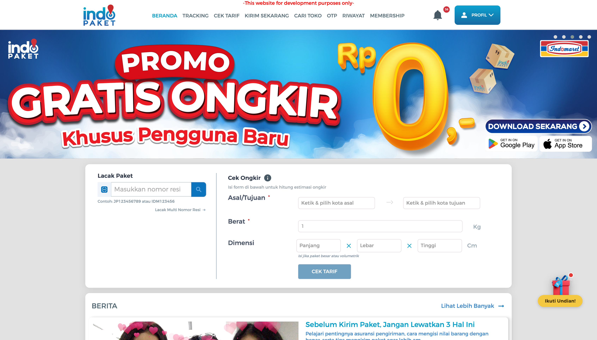 | 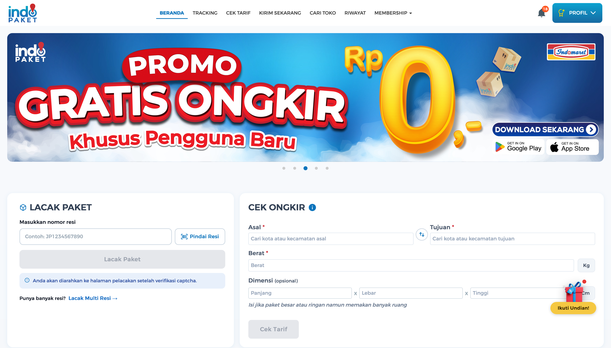 |

**What changed**

- **Slider** — added visible pagination dots and breathing room from the content below, instead of one static banner butting straight into the page
- **Lacak Paket** — added a "Pindai Resi" (scan) shortcut, a dedicated "Lacak Paket" button, and a note on what happens after submitting (captcha verification)
- **Cek Ongkir** — split the combined "Asal/Tujuan" field into two clearly labeled fields with a swap shortcut, and marked Dimensi as explicitly optional

### Cari Toko (Store Locator)

*Shifted store details from a map-blocking popup to a compact card that keeps the map and result list in view.*

Both versions kept a results list alongside the map. The problem was the selected-store popup: it was large enough to cover a significant part of the map, and closing it to check a different result meant losing sight of where the selected pin sat relative to the rest. *(Heuristic reference: Visibility of System Status.)*

**Before** — *Existing experience · Sep 2023*
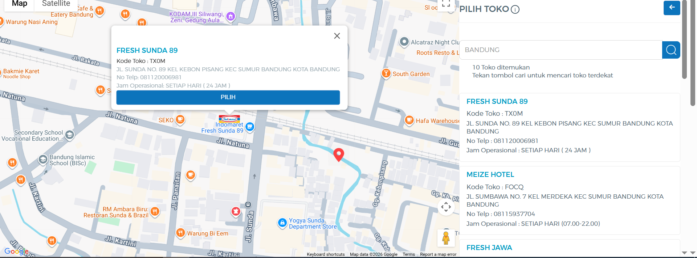

**After** — *Current iteration · 2026*
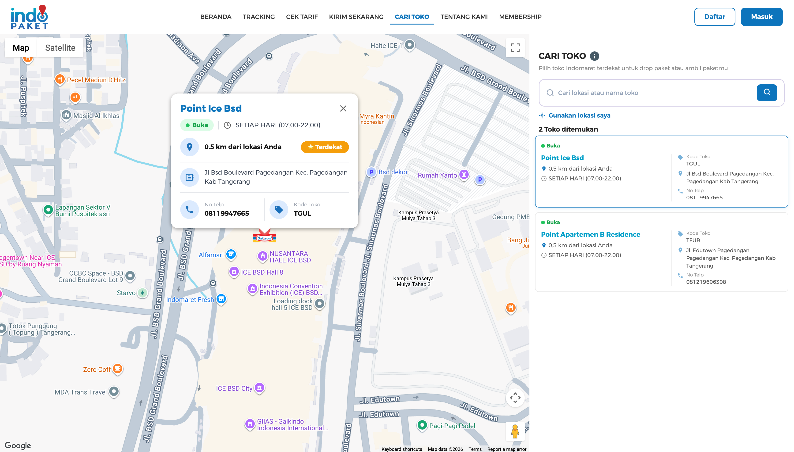

**What changed**

1. **Selected store card** — reduced in size and given a clear structure (status, distance, "Terdekat" badge, contact) so it obscures less of the map and surrounding results
2. **Result list** — the selected store is highlighted in the list, keeping map pin and list entry connected instead of relying on the popup alone
3. **No-results feedback** — a plain "0 Toko ditemukan" became an inline, actionable "Lokasi tidak ditemukan. Coba kata kunci lain."

| No results — Existing experience · Sep 2023 | No results — Current iteration · 2026 |
|---|---|
| 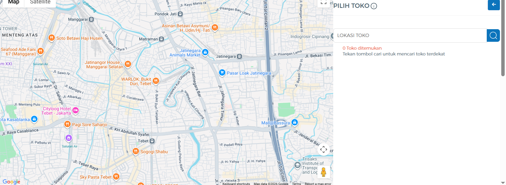 | 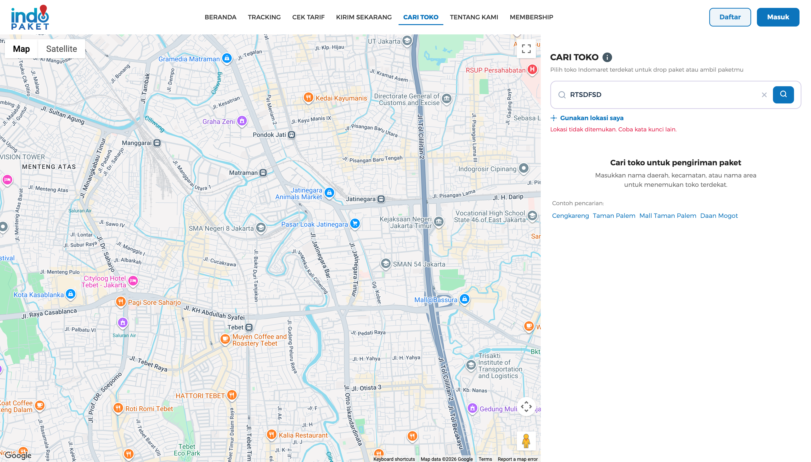 |

### Kirim Sekarang (Ship Package)

*Gave users stuck at the app-handoff screen an actual way forward, instead of a dead end.*

For "Jemput & Antar ke Alamat" deliveries, handing off to the mobile app used to be a bare card — one paragraph and a single button, with no fallback for users who didn't have the app installed yet.

| Existing experience · Sep 2023 | Current iteration · 2026 |
|---|---|
| 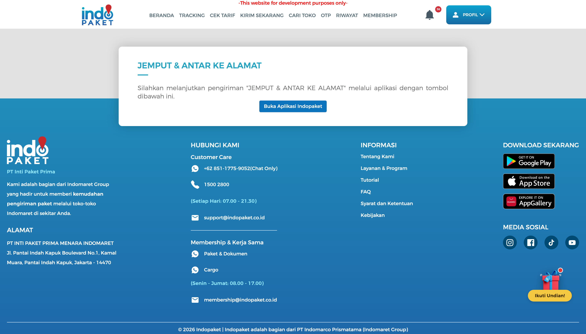 | 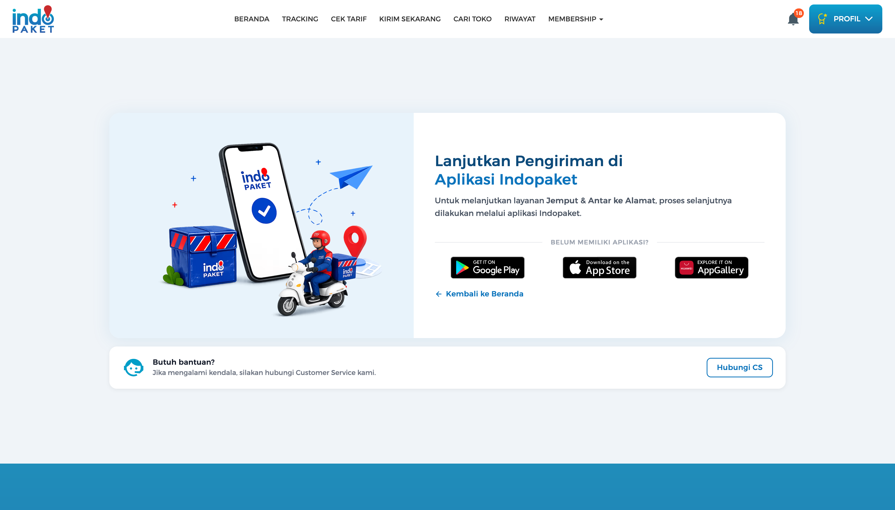 |

**What changed**

- Added Google Play / App Store / AppGallery badges for users who don't have the app yet, instead of dead-ending on a single "open the app" button
- Added a "Butuh bantuan? Hubungi CS" fallback card for users who get stuck mid-handoff
- Replaced the bare text card with an illustration consistent with the rest of the site's redesigned states

### Riwayat & Tracking

*Turned a broken-image dead end into a self-diagnosis state users can act on.*

The old "not found" state on Riwayat (History) was a bare "Tidak ditemukan" message with a broken image and no guidance. *(Heuristic reference: Help Users Recognize, Diagnose, and Recover from Errors.)* The old multi-resi tracking input also drew scattered heatmap clicks with no clear pattern — a sign users weren't sure how single-resi tracking differed from tracking multiple resi at once.

| Existing experience · Sep 2023 | Current iteration · 2026 |
|---|---|
| 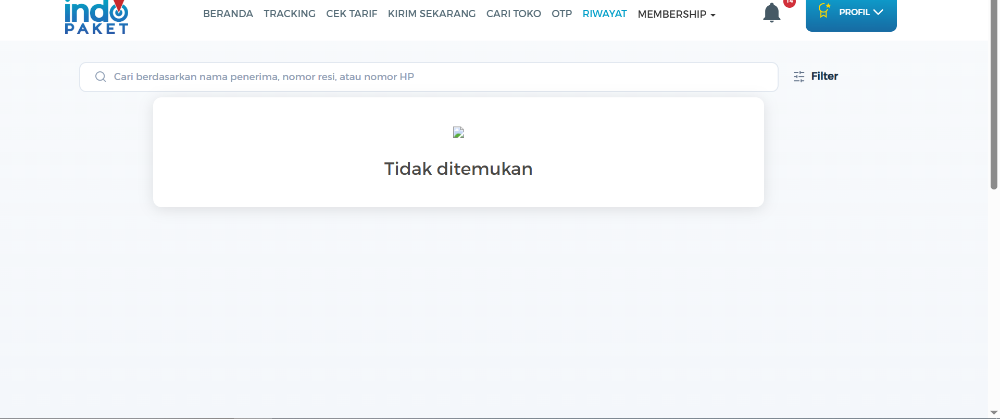 | 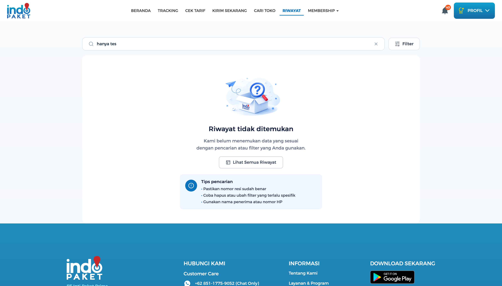 |
| 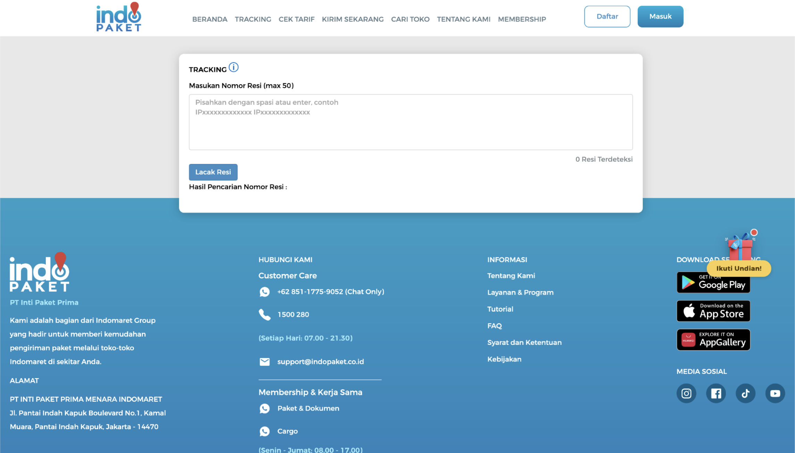 | 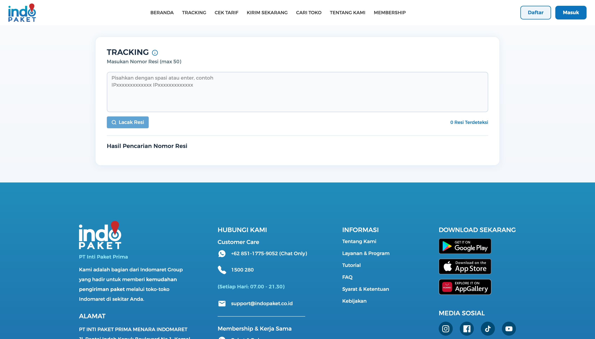 |

**What changed**

- Riwayat's broken-image dead end became an illustration + headline + self-diagnosis checklist — the same pattern now backs the Tracking page's resi-not-found result too, so error states feel consistent instead of one-off
- Tracking input got a visual refresh, though the underlying single vs. multi-resi ambiguity is still an open item for a follow-up iteration, not solved here (see [Constraints & Trade-offs](#constraints-and-trade-offs))

---

## Account and Authentication

How a new user registers and verifies their account.

### Login and Register

*Split a screen where two flows competed for attention into two focused, single-purpose ones.*

| Daftar (Register) — Existing experience · Sep 2023 | Daftar (Register) — Current iteration · 2026 |
|---|---|
| 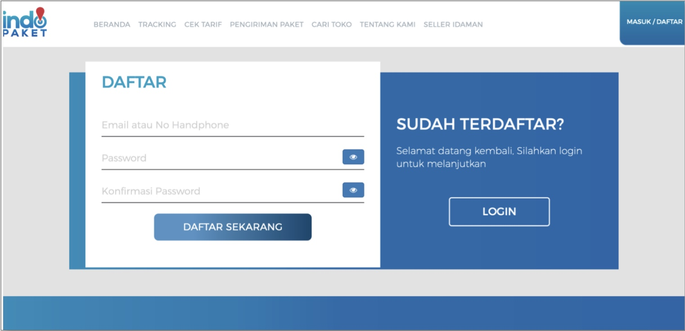 | 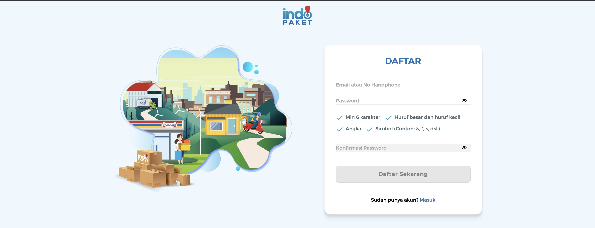 |

The registration form and the "Sudah Terdaftar? Login" panel used to compete on one screen — heatmap data showed clicks scattered across both. Login and Register are now distinct, focused pages instead of one competing screen. *(Heuristic reference: Aesthetic and Minimalist Design.)*

### OTP Verification

*Replaced a bare countdown with confirmation of what's happening and what to do if it doesn't.*

| Kode Verifikasi (OTP) — Existing experience · Sep 2023 | Kode Verifikasi (OTP) — Current iteration · 2026 |
|---|---|
| 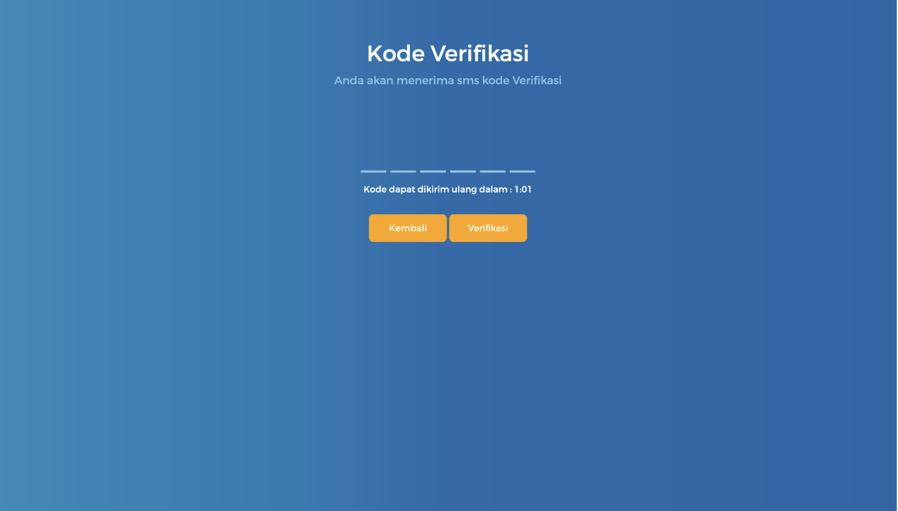 | 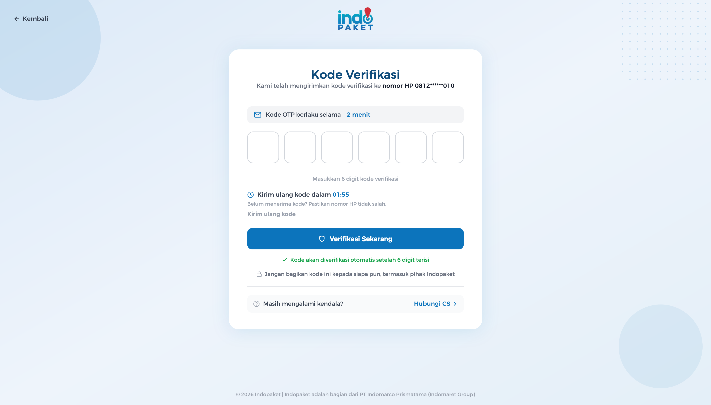 |

The old screen only showed a countdown and a bare set of input boxes — no confirmation of which number the code went to, no reassurance about what to do if it didn't arrive. The redesign shows the masked destination number ("nomor HP 0812\*\*\*\*\*\*010"), how long the code is valid, what to do if it hasn't arrived, and a reminder not to share the code with anyone, including Indopaket staff. *(Heuristic reference: Recognition Rather Than Recall.)*

---

## Design Decisions

- Clarified the single vs. multi-resi tracking entry points instead of one ambiguous field
- Separated Login and Register into distinct, focused flows instead of one competing screen
- Redesigned empty/error states to guide users toward a next action instead of leaving them stuck
- Standardized recurring UI patterns (status indicators, cards, tables) across sections that had previously diverged

## Implementation

**Shipped within the existing Laravel frontend, not rebuilt from scratch.** The redesign wasn't handed off as static screens. Built with **Laravel Blade** and styled with **Tailwind CSS**, I translated the interaction model directly into production templates — working within existing component patterns, backend contracts, and business rules — focused on shipping something maintainable by the rest of the team going forward, not just a one-off visual pass.

**Next iteration:** the platform is planned to be rewritten in React/Next.js, which will consolidate the patterns introduced during this redesign into a more reusable frontend architecture.

**My role across this project:** UX analysis (heuristic evaluation, heatmap review) · information architecture · interaction design · frontend implementation (Laravel/Blade) · design-to-code translation.

## Impact

**Product** — Consolidated a feature-by-feature web platform into a more coherent, task-oriented experience across 9 core flows, without disrupting the operational and referral logic other teams depend on.

**UX** — Removed extraneous cognitive load (duplicated fields, unlabeled inputs, oversized popups) while leaving the domain's inherent complexity intact and legible.

**Engineering** — Delivered the redesign as production Laravel/Blade code with reusable patterns (empty/error states, cards, status indicators) the team can extend, rather than a design handoff that stops at Figma.

**For sellers and internal teams** — Login/Register no longer compete for attention on one screen, store selection no longer loses the user's place behind a popup, and the app-handoff and OTP flows leave people with a clear next step instead of a dead end.

## Outcome

Clearer navigation, a more consistent information hierarchy, and error/empty states that guide users instead of dead-ending them — for a platform used daily by sellers and internal teams. Some friction points, like the single vs. multi-resi tracking ambiguity, were identified but intentionally left for a follow-up iteration rather than rushed into this pass.
